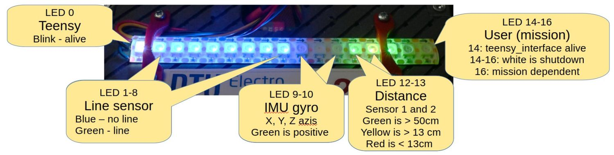

# robobot project

>[!NOTE]
> This is a subset of nice to know and hard to remember commands. For anything else see the full [Wiki page](https://rsewiki.electro.dtu.dk/index.php/Robobot_B)

Connect to robot with, password is `grenen`
```
ssh local@10.197.217.76
```

The directory structure on the robot is:
```
/home/local/
|
+- svn        - Directory for software from the subversion repository (Robobot-specific software).
|  +- regbot  - Directory for the Teensy software (firmware); this part is called Regbot.
|  |  +- regbot_gui  Debug app for Regbot.
|  |  +- regbot      The firmware source code.
|  +- robobot        Directory for the Robobot-specific code.
|  |  +- setup       Directory with some default configuration files.
|  |  +- teensy_interface  From Teensy to MQTT
|  |  |  +- src      Source code 
|  |  |  +- build    Build directory with Makefile
|  |  |  |  +- log*  Directory for data-monitoring logfiles
|  |  |  |  robot.ini    Configuration and calibration file
|  |  +- ip_disp     Small app to update the IP address of the Raspberry.
|  |  |  +- build    Build directory with Makefile
|  |  |     +- log_*.txt Logfiles for IP and temperature monitoring
|  |  +- mqtt_python        The main mission app
|  |  |  +- mqtt-client.py  Main app file
|  |  +- stream_server      The camera server
|  |  +- teensy_firmware_8  Arduino code for the Teensy
|  +- log     - Directory with logfiles from ip_disp (IP, users and CPU temperature)
on_reboot.bash     - Script to start applications that should start after a reboot (ip_disp and teensy_interface)
mission_start.bash - Script to start mission app, when start button is pressed (and not running already)
```

### LED matrix
The Teensy maintains the LED band. Most LEDs show sensor values. The last 3 LEDs can be set by commands to the Teensy.

